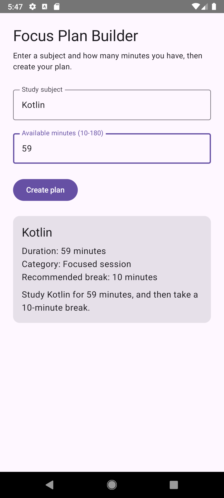

# Focus Plan Builder

**Name:** Suchir Jolapara
**Assignment:** CS501 E1 - Individual Coding Assignment 2: Focus Plan Builder

## Description

Focus Plan Builder is a single-screen Android app built with Kotlin and Jetpack Compose that helps a student turn a subject and a block of available time into a short study plan. The user enters a subject and a number of minutes, and once both inputs are valid, the app calculates a duration category (Quick review, Focused session, or Extended session) and a recommended break length, then displays the result in a Material 3 card.

## Running the App

1. Open the project in Android Studio.
2. Select or create an emulator (tested on a Medium Phone, API 28).
3. Click Run. No additional setup or configuration is required.

## Screenshot

## State and Recomposition

**Which composable owns the application state?**

FocusPlanRoute owns all the state - subject, minutesText, and plan. It passes these down to FocusPlanScreen as parameters and receives user actions back through callback functions. FocusPlanScreen itself never creates or holds any state directly; it only displays whatever it's given and reports events upward.

**Why are the text-field values stored as String rather than Int?**

A TextField in Compose always works with String input, since a user can type partial, empty, or invalid text at any point while typing. Storing the raw text as a String lets the field reflect exactly what the user typed at every keystroke, and the conversion to a number only happens separately, when it's actually needed for validation or calculation.

**Why is toIntOrNull() safer than toInt()?**

toInt() throws an exception and crashes the app if the string isn't a valid number - which would happen constantly here, since the user can type letters, leave the field blank, or type nothing at all. toIntOrNull() returns null instead of crashing, so invalid input can be checked safely with a simple null comparison rather than wrapping every conversion in a try/catch block.

**What state change causes the button to be recomposed?**
The button's enabled parameter is driven by canCreatePlan, which is recalculated every time subject or minutesText changes. Since canCreatePlan is derived directly from those two state values rather than stored separately, any edit to either field triggers a recomposition that re-evaluates the condition and updates the button's enabled state automatically.

**What does rememberSaveable preserve that a local variable would not?**
A local variable or plain remember only survives while the same Activity instance stays alive. Rotating the device destroys and recreates the Activity, wiping out anything held in ordinary remember. rememberSaveable writes its value into the saved instance state bundle, so it survives that recreation and the field still shows the same text the user typed, even after rotation.

## Generative-AI Disclosure

I used Claude in this assignment for guidance on structuring the state-hoisting pattern (FocusPlanRoute/FocusPlanScreen), understanding Compose concepts like derived state and rememberSaveable, and debugging as I built the app.